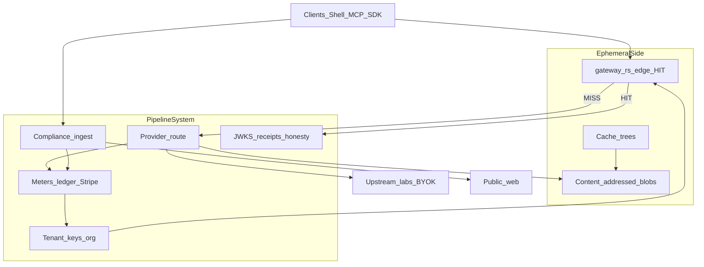
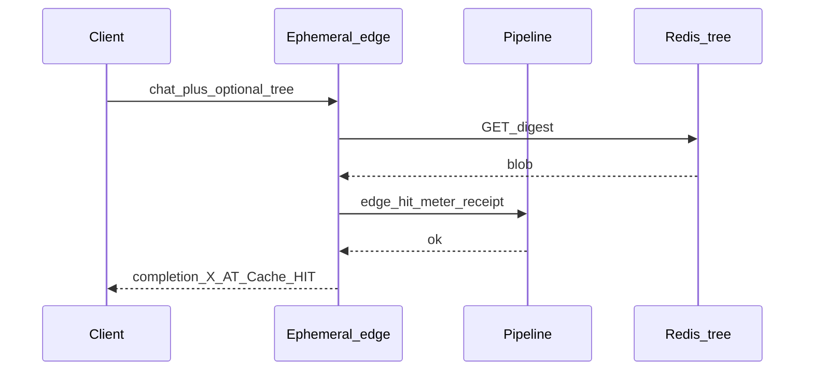
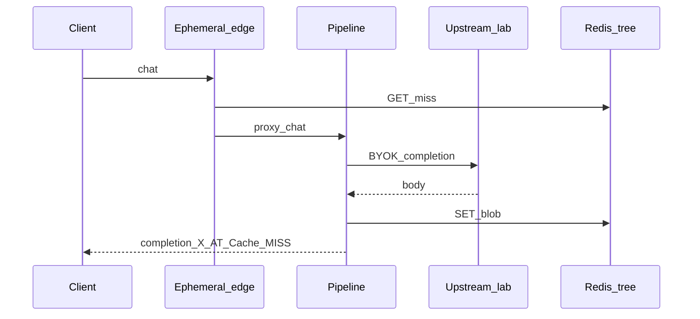

# Architecture overview

Inside withOhm: ephemeral exact-replay and a durable pipeline, connected by the crossing.

## Top-level overview

Instead of treating an AI gateway as a single opaque proxy tied to one vendor’s session, withOhm splits AI traffic control into two independent containers: an **Ephemeral Side** and a **Pipeline System**. Clients (Agent Shell, SDKs, MCP) talk to one OpenAI-compatible ingress; the two containers meet on every request at a named crossing — **HIT or MISS** — that is metered and, on HIT, receipted.

This separation is what makes exact-replay economically and operationally real. Inventory can be forked, isolated, and promoted without pretending to be a database. Money, policy, and compliance can stay durable without sitting on the Redis hot path.

- **Ephemeral Side** — optimized for latency and mechanical repeat. Content-addressed completions, cache trees, edge GET. This layer does not own billing truth or legal policy; it can TTL, freeze, or tear down without losing the company’s durable record.
- **Pipeline System** — optimized for correctness of *governance*: tenancy, Stripe meters, compliance ingest, provider route honesty, JWKS receipts, org audit and FinOps. This layer defines who may cross, what a crossing costs, and what claims we will stand behind.

Labs (BYOK or managed pool) remain outside both containers. Public web enters only through the Pipeline’s compliance gate. Exact-replay inventory never becomes a training corpus.

**Note: What is the difference between Neon and withOhm?**

Neon (Lakebase Postgres) splits **ephemeral compute** from **durable storage** so database state can branch and restore as metadata. withOhm splits **ephemeral exact-replay inventory** from a **durable governance pipeline** so mechanical AI repeats can be isolated and billed without wholesale model theatre. Neon branches state. Labs discount prefixes. Ohm branches exact replay — and the pipeline bills the crossing. Compose them in CI (`NEON_BRANCH` + `X-Ohm-Cache-Tree`); do not confuse the products. See [CACHE_TREES.md](CACHE_TREES.md).

## Resource hierarchy

While the sections below describe the runtime split, withOhm organizes customer resources roughly as:

| Concept | Description | Relationship |
|---------|-------------|--------------|
| Organization | SSO, members, policy, FinOps export | Contains tenants / keys |
| Tenant | Billing and meter identity | Owns cache trees and ledger events |
| Cache tree | Named exact-replay inventory (`main`, `pr-842`, …) | Holds digests → blobs |
| API key | Auth material (`sk-at-*`) | Bound to a tenant (and optionally an org) |
| Account profile | Email + password hash beside apikey SHA-256 | Login restores Intermediate bearer |
| Path / cost center | Attribution labels (`X-Ohm-Path`, cost center) | Ledger dimensions — **not** cache partitions |
| Operation | Async or admin action (checkout, promote, retain — phased) | Audited on the Pipeline |

## Ephemeral Side

The Ephemeral Side is where identical requests become free of upstream tokens. From the client’s perspective nothing about the OpenAI chat shape is replaced: messages in, completion out, headers for cache and billing.

What is different is what this side is responsible for. **It exists to serve and store exact-replay inventory, not to define money or law.**

### Components

- **Edge (`gateway-rs`)** — Redis GET on the hot path; stamps plane/cache headers; meters HIT only via the control-plane gate.
- **Content-addressed blobs** — immutable completion JSON at `digest` (SHA-256 of canonical model + messages + extras).
- **Cache trees** — named namespaces over digests. Default `main` keeps today’s v2 key layout; named trees use v3. See [CACHE_TREES.md](CACHE_TREES.md).
- **Request context** — BYOK header (never persisted), optional tree and path headers, `cache_control: no_store`.

### How ephemeral fits into the system

When a chat request arrives:

- The request is canonicalized and hashed.
- On **HIT**, the blob is returned; the Pipeline mints meter + optional Ed25519 receipt. The lab is not called.
- On **MISS**, the Pipeline routes to an upstream provider (BYOK); the completion is written into the active tree (unless `no_store`).

Exact-match is absolute inside a tree. There is no semantic or fuzzy cache. Cross-tree visibility is only via explicit lineage ops (fork / promote — Phase 1+), never ambient bleed.

## Pipeline System

If the Ephemeral Side is responsible for replay inventory, the Pipeline System is responsible for **who may cross, what it costs, and what we will claim in public**.

Rather than one monolith “proxy brain,” governance is composed of clear roles:

- **Auth / tenancy** — API keys, org SSO, suspension and caps
- **Meters → ledger → Stripe** — HIT / MISS / fetch; clean ledger; seat checkout
- **Compliance ingest** — purpose, robots, SSRF, PII, Web Bot Auth — before bytes reach a model
- **Provider route** — multi-vendor BYOK; pre-first-byte failover honesty (no mid-stream magic)
- **Trust** — JWKS directory, HIT receipts, published honesty map
- **Org policy / audit / FinOps** — allowlists, spend caps, export

### Correctness of claims

A HIT is not “free magic.” It is:

1. An identical-request replay from tenant-scoped inventory  
2. A metered pipe event  
3. Optionally a signed receipt verifiable against the public key directory  

Savings endpoints stay `estimate_only`. The honesty map publishes non-goals so marketing cannot outrun the pipe ([`GET /v1/public/honesty`](https://api.withohm.dev/v1/public/honesty)).

## HIT path: replaying without the lab

1. **Canonicalize and hash** the request (tree-scoped key).  
2. **GET** from Redis on the Ephemeral Side.  
3. **Pipeline gate** records HIT meter and may mint `X-Ohm-Receipt`.  
4. **Return** the blob. No upstream tokens.

## MISS path: ask the model, then store

1. **MISS** on inventory.  
2. **Pipeline** enforces auth, org policy, and spend caps.  
3. **Upstream** generates (BYOK or managed pool).  
4. **SET** into the active tree unless `no_store`.  
5. **Meter** MISS (and fetch, if web context was injected earlier on the Pipeline).

Web context is never a back door around compliance: ingest runs on the Pipeline before digest and upstream.

## Durability of governance (not of every blob)

Durability in withOhm is layered on purpose:

- If the **edge** dies → traffic falls through to the control plane; correctness of billing stays with the Pipeline.  
- If a **cache blob** TTLs → that exact-replay entry is gone unless retained (Phase 4); meters and ledger remain.  
- If **Stripe or Redis meta** is unhealthy → reconciler and honesty/ops surfaces exist so failure is visible, not vibes.  
- **Retain / archive** (phased) may copy blobs off the hot path for audit — still not a training corpus, still not object storage on the HIT critical path.

## What this architecture enables

This design turns traditionally wasteful AI operations (re-paying identical agent/CI prompts; mixing preview pollution into prod HIT inventory) into **inventory and metadata operations**.

- **Zero-upstream replay** — identical requests answer from Redis; the lab is not paid twice.  
- **Tree-scoped isolation** — PR/agent inventories diverge without cloning tenants or databases ([CACHE_TREES.md](CACHE_TREES.md)).  
- **Promote as index work** (Phase 1+) — bring new digests to `main` without rewriting history as a bulk export.  
- **Compose with Neon** — data branch + replay tree in one CI slug; complementary, not competitive.  
- **Governed browse** — public web through robots/PII/SSRF before model contact.  
- **Auditable claims** — receipts and honesty map bind marketing to machinery.

## In short

withOhm is an AI traffic control plane that treats:

- exact-replay inventory as **ephemeral and replaceable** (trees, TTL, edge);  
- money, policy, compliance, and trust as **durable pipeline concerns**;  
- the HIT/MISS crossing as the **source of economic truth** for the pipe;  
- labs and the public web as **outside** systems reached only through explicit gates.

The result is infrastructure that makes mechanical AI traffic cheap to repeat, hard to lie about, and possible to attribute — without becoming a model lab and without cosplaying a database. Product thesis: [VISION.md](VISION.md) · [GEM_POSITION.md](GEM_POSITION.md).

## Related docs

- [CACHE_TREES.md](CACHE_TREES.md) — branchable exact-replay (phased)  
- [REDIS_MESH.md](REDIS_MESH.md) — edge/ Redis roles  
- [RECEIPTS.md](RECEIPTS.md) — HIT proof  
- [SECURITY.md](SECURITY.md) · [LEGAL.md](LEGAL.md) — trust and operating bounds  
- [STREAMING.md](STREAMING.md) — failover honesty  
