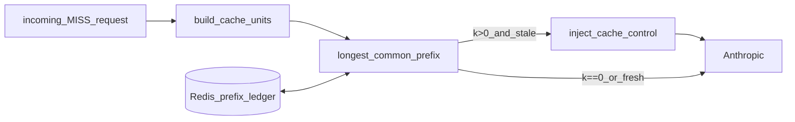

# Breakpoint autopilot — ADR (Phase 2)

Auto-places Anthropic `cache_control` prompt-caching breakpoints for naive
agent clients. This is the sharpened wedge for the Cursor/agentic-IDE
"resend the whole context window every turn" cost problem: Ohm already sits
in the request path on every MISS, so it can correctly engineer the
provider's own prefix caching on the customer's behalf, instead of only
contrasting itself against it (see [GEM_POSITION.md](GEM_POSITION.md),
[SIEGE_DEFENSE.md](distribution/SIEGE_DEFENSE.md)).

Parent architecture: [ARCHITECTURE.md](ARCHITECTURE.md). Sibling ADR (whole-
request exact-replay, a different mechanism this extends): [CACHE_TREES.md](CACHE_TREES.md).

## Problem

Cursor-style agent clients resend the entire growing transcript every turn.
Anthropic (and OpenAI, automatically) will discount the *unchanged prefix*
of that transcript — but only if a `cache_control` breakpoint is placed on
the right block, inside the provider's lookback window, before the TTL
expires. Naive clients either place no breakpoint, or place it on the last
(per-turn-varying) block, which never hits. Ohm can fix this transparently.

## Design

Implementation: [src/at_utility/cache_autopilot.py](../src/at_utility/cache_autopilot.py).
Runs only on the MISS path, only for `claude-*` models, only when
`AT_CACHE_AUTOPILOT_ENABLED=true` (default on).

1. **Units, not raw blocks.** Walk `tools` (as one unit) + `messages` (one
   unit per message) in Anthropic's own cache hierarchy order
   (tools → system → messages). This is coarser than Anthropic's own
   content-block granularity but byte-exact and cheap — same philosophy as
   the whole-request exact-replay cache, applied one layer down.
2. **Session identity.** `X-Ohm-Session` header / `ohm_session` body field
   if sent; otherwise a hash of the first two messages (system prompt +
   first user turn), which stay constant while a conversation grows.
3. **Prefix ledger.** Redis key `at:{tenant}:cacheledger:{session_id}`,
   TTL `AT_CACHE_AUTOPILOT_TTL_SECONDS` (default 300s — matches Anthropic's
   own default cache TTL, so Ohm stops tracking a session exactly when the
   provider's cache entry would have expired anyway). Stores the previous
   request's per-unit digests + the index of the last injected breakpoint.
4. **Diff.** Longest common prefix `k` between this request's unit digests
   and the ledger's. `k == 0` → nothing stable yet (first turn, or the
   prefix changed outright) — seed the ledger, inject nothing.
5. **Placement.** If `k > 0`, the target is unit `k-1` (the last unit still
   identical to last turn). Skip if a still-fresh breakpoint already covers
   it within `AT_CACHE_AUTOPILOT_LOOKBACK_UNITS` (default 16, safety margin
   under Anthropic's 20-block lookback) — no need to spend another one.
   Otherwise inject `cache_control: {"type": "ephemeral"}`: onto the last
   tool in `tools` if the target is the tools unit, or onto the last
   content block of the target message (upgrading a plain string to a
   single-block content array if needed).
6. **Client-managed opt-out.** If the client's own request already carries
   *any* `cache_control` anywhere (tools or messages), autopilot never
   injects a second one for that request — Anthropic caps at 4 explicit
   breakpoints total, and colliding with a client's own placement wastes a
   slot rather than helping. The ledger still records digests so a client
   that stops managing its own breakpoints falls back to autopilot cleanly.
7. **Never touches Ohm's own cache key.** The exact-replay digest
   (`cache.py: request_digest`) is computed from the client's *original*
   request before autopilot runs. Only the copy of `messages`/`tools` sent
   upstream to Anthropic is mutated. Ohm's own HIT rate is unaffected.

## Client surface

- Header: `X-Ohm-Session: <id>` (optional; falls back to a content anchor)
- Body: `ohm_session` (optional; header wins)
- Response echo: `X-Ohm-Cache-Autopilot: injected | unchanged | no_stable_prefix | client_managed | disabled`

## Non-goals

- **Not semantic/fuzzy caching.** Every comparison is a sha256 digest
  equality check over normalized units — identical standing non-goal as
  the whole-request exact-replay cache (see [VISION.md](VISION.md),
  [GEM_POSITION.md](GEM_POSITION.md)). This is exact-match applied at
  finer granularity than "the whole request," not a reversal of that
  boundary.
- **Not sub-message block diffing (yet).** Units are whole messages, not
  Anthropic's finer content blocks. Good enough for the dominant
  append-only-transcript pattern; a future phase could refine this.
- **Not active for OpenAI-shaped upstreams.** OpenAI's own prompt caching
  is automatic server-side (≥1024 tokens); Ohm's only job there is to never
  reorder/re-serialize the prefix, which the existing passthrough already
  guarantees. No autopilot injection logic runs for non-`claude-*` models.
- **No cross-session sharing.** Each `(tenant, session_id)` ledger is
  independent; no attempt to detect that two differently-identified
  sessions happen to share a prefix.

## Rust edge

No changes needed. Edge cache-eligible requests never involve autopilot —
the edge only ever serves whole-request exact-replay HITs; MISSes always
proxy to Python, where the client's original request still reaches this
code path unmodified before autopilot builds its own upstream-only copy.

## Phase 3 — session-aware pre-warm

Implementation: `POST /v1/chat/completions/prewarm` and
`GET /v1/cache/sessions/{session_id}` in [src/at_utility/main.py](../src/at_utility/main.py);
[`session_status()`](../src/at_utility/cache_autopilot.py) reads the same
prefix ledger Phase 2 writes.

**Why this is client-triggered, not an autonomous Ohm-side cron.** Ohm is
BYOK by default — the upstream provider key lives only in the
`X-Ohm-Upstream-Key` header of the request that's in flight, and is never
persisted (see [ARCHITECTURE.md](ARCHITECTURE.md), [LEGAL.md](LEGAL.md)).
An autonomous background scheduler that fires priming calls minutes later
would require either storing customer upstream keys (a real security/
compliance regression) or storing raw prompt content server-side to replay
it later (a data-retention regression neither compliance module accepts
today). Instead:

1. The client (an IDE extension, an Ohm SDK wrapper, etc.) polls
   `GET /v1/cache/sessions/{session_id}` — a cheap read of the ledger's
   `ttl_remaining_seconds` — on its own idle timer.
2. When the TTL is running low and the client knows the user is likely to
   resume soon, it calls `POST /v1/chat/completions/prewarm` with its
   *current* transcript and its *own* upstream key — the same BYOK contract
   as every other call. No new data-retention surface.
3. The endpoint forces `max_tokens: 1`, runs the exact same autopilot logic
   as a real MISS (so the same breakpoint placement rules apply), fires the
   real upstream call (a genuine `cache_creation` write Anthropic bills for),
   and returns a throwaway ack — never touching Ohm's own exact-replay cache.
4. Gated by the same org spend-cap check a real MISS would hit
   (`_spend_cap_on_miss` — hard mode blocks outright) since this is optional
   spend the tenant didn't explicitly request in the moment.
5. Metered on its own `prewarm_tokens` / `prewarm_usd` ledger rail — priced
   like a cache_miss, but never counted toward `cache_hit`/`cache_miss` so
   it can't inflate or deflate the hit-ratio a tenant uses to judge Ohm's
   *real* conversational savings. It also syncs to Stripe (when configured)
   under its own `stripe_meter_event_prewarm` event — deliberately distinct
   from `stripe_meter_event_cache_miss` — so a tenant reading raw Stripe
   usage records can't mistake a keep-warm ping for a real MISS either.
   `stripe_meter_event_prewarm` is empty by default (no Stripe sync at all)
   until an operator provisions the dedicated Billing Meter + Price.
6. Requires `AT_CACHE_AUTOPILOT_ENABLED=true` — with autopilot off, no
   `cache_control` breakpoint would be placed and the call would just spend
   real upstream tokens for nothing, so the endpoint rejects it outright.

**For managed-key (enterprise) tenants only:** since Ohm already holds an
env-level provider key server-side for those orgs (`AT_ENTERPRISE_MANAGED_KEYS`
+ org `managed_keys` policy), a genuine autonomous sweep becomes a smaller,
well-scoped follow-up (still would need an opt-in + a decision on whether to
store even minimal replay content) — not built in this phase; the
client-triggered primitive above covers BYOK tenants, which are the
default and majority case.
