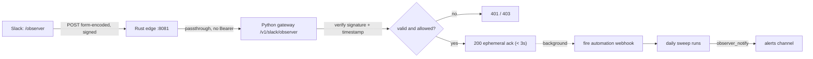

# `/observer` slash command — execution plan

Status: **design, not built.** This is the execution method for adding a Slack
slash command that runs the daily sweep on demand. It is separated from the rest of
the automation work because it is the first piece that requires a new inbound HTTP
endpoint on production, and that raises the security bar accordingly.

## What the user gets

Someone types `/observer` in Slack and, within three seconds, sees an ephemeral
"running the sweep…" acknowledgement. A short time later the result lands in the
alerts channel through the same Block Kit path the scheduled run already uses. No new
UI, no new place to read output.

## Why this shape

Slack slash commands are not webhooks in reverse. Slack POSTs to a **request URL** you
own and expects a `200` within **3 seconds** ([docs.slack.dev](https://docs.slack.dev/interactivity/implementing-slash-commands)),
which is far less time than a cloud-agent sweep takes. So the endpoint cannot do the
work inline — it must acknowledge immediately and trigger the sweep asynchronously.

The request URL belongs on the **Python gateway** (`api.withohm.dev`), because that is
already the public HTTPS surface with a deploy pipeline, config, and secret injection.
No standalone service is warranted.



## The gotcha to plan for first

`/v1/slack/*` is a new path, and the Rust edge sits in front of every request. Its
`authorize()` runs on anything not explicitly on the passthrough list and will reject a
Slack request — which carries no `Bearer` token — with a **401** before Python ever
sees it. This is the exact class of bug that made `/v1/admin/*` unreachable. The fix is
the same: add Slack commands to the passthrough set next to the existing
`is_stripe_webhook`, `is_ready`, `is_public_checkout`, `is_public_read` in
[`gateway-rs/src/main.rs`](../../gateway-rs/src/main.rs):

```rust
let is_slack_command =
    path_only.starts_with("/v1/slack/") && method == Method::POST;
```

Fold it into `is_passthrough`. Verify it the same way the admin fix was verified: a
signed request returns 200, everything else is untouched.

## Signature verification (the security core)

Slack signs every request. The endpoint must verify it over the **raw** body bytes
before parsing, because re-serializing changes the signed bytes.

1. Read `X-Slack-Request-Timestamp`; reject if more than 300 seconds old (replay guard).
2. Compute `v0:{timestamp}:{raw_body}`, HMAC-SHA256 with `SLACK_SIGNING_SECRET`, hex,
   prefixed `v0=`.
3. Constant-time compare against `X-Slack-Signature`. Mismatch is a `401`.

The signing secret comes from the Slack app's Basic Information page and is **not** the
incoming-webhook URL — a distinct value with a distinct job.

## After the signature passes

- **Authorize the caller.** A valid signature only proves Slack sent it, not that the
  sender is allowed. Allowlist by `team_id` and a small set of `user_id`s (or a
  dedicated channel). This endpoint starts a billable cloud-agent run, so it must not
  be open to the whole workspace.
- **Acknowledge within 3s.** Return `{"response_type": "ephemeral", "text": "Running
  the daily sweep — results will post to the channel."}`.
- **Trigger asynchronously.** In a background task, POST to the automation's webhook
  trigger URL. The result is reported by the sweep itself through `observer_notify`, so
  the endpoint does not wait for it or hold Slack's `response_url`.

## Secrets

| Name | Where | Purpose |
|------|-------|---------|
| `SLACK_SIGNING_SECRET` | cluster `at-utility-secrets` → gateway | verify inbound Slack requests |
| `CURSOR_OBSERVER_WEBHOOK` | cluster `at-utility-secrets` → gateway | the automation's webhook trigger URL |
| `SLACK_WEBHOOK_URL` | already set (Cursor Secrets, for the automation) | the reply path |

No bot token and no OAuth: slash command + signed request URL + the existing incoming
webhook for the reply covers the whole flow, which keeps the app single-workspace and
undistributed.

## Execution checklist

1. **Automation:** add a webhook trigger to the daily automation alongside its
   schedule; capture the generated URL (and its key, if the trigger issues one).
2. **Edge:** add `is_slack_command` to the passthrough set; build and verify a signed
   request proxies through while a Bearer-less non-Slack request is unaffected.
3. **Gateway:** add `POST /v1/slack/observer` — raw-body read, timestamp + HMAC
   verification, caller allowlist, 3-second ephemeral ack, background trigger of
   `CURSOR_OBSERVER_WEBHOOK`.
4. **Secrets:** add `SLACK_SIGNING_SECRET` and `CURSOR_OBSERVER_WEBHOOK` to
   `at-utility-secrets`; roll `gateway` and `gateway-rs`.
5. **Tests:** unit-cover signature verification (valid, tampered, stale timestamp) and
   the allowlist; these run without network. Locally, curl a correctly-signed request
   and confirm the 200 ack.
6. **Slack app:** create the `/observer` command with request URL
   `https://api.withohm.dev/v1/slack/observer`, add the `commands` scope. Do this
   **last** — Slack pings the URL on save, so the endpoint must be deployed first.
7. **Deploy order:** merge so `deploy.yml` ships both planes, confirm the edge and
   gateway are live, then point the Slack command at the URL.

## Cost and abuse notes

Each invocation starts a cloud-agent run that costs model tokens and does real work, so
the allowlist is not optional and a light per-user cooldown (for example, ignore a
repeat within 60 seconds) is worth adding. Keep the app undistributed; there is no
reason for another workspace to reach this endpoint, and undistributed keeps the attack
surface to a single install.

## What this deliberately does not add

No buttons, no Events API, no bot user. Each of those needs a persistent interaction
handler and a broader-scoped token, which is a larger commitment than an on-demand
trigger justifies. If an "acknowledge / snooze" workflow is ever wanted, it builds on
the same request-URL plumbing this plan establishes.
