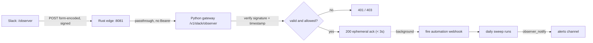

# `/observer` slash command

Status: **built.** The gateway route, edge passthrough, and tests are in the repo; what
remains is operator configuration (the Slack app, two secrets, and a webhook trigger on
the automation). This is the first piece with a new inbound HTTP endpoint on
production, so the security bar is set accordingly.

## What the user gets

Someone types `/observer` in Slack and, within three seconds, sees an ephemeral
"running the sweep…" acknowledgement. A short time later the result lands in the
alerts channel through the same Block Kit path the scheduled run already uses. No new
UI, no new place to read output.

## Why this shape

Slack slash commands are not webhooks in reverse. Slack POSTs to a **request URL** you
own and expects a `200` within **3 seconds** ([docs.slack.dev](https://docs.slack.dev/interactivity/implementing-slash-commands)),
which is far less time than a cloud-agent sweep takes. So the endpoint cannot do the
work inline — it must acknowledge immediately and trigger the sweep asynchronously.

The request URL belongs on the **Python gateway** (`api.withohm.dev`), because that is
already the public HTTPS surface with a deploy pipeline, config, and secret injection.
No standalone service is warranted.



## The edge passthrough (the load-bearing detail)

`/v1/slack/*` is a new path, and the Rust edge sits in front of every request. Its
`authorize()` runs on anything not on the passthrough list and would reject a Slack
request — which carries no `Bearer` token — with a **401** before Python ever saw it.
That is the exact class of bug that made `/v1/admin/*` unreachable. So Slack commands
join the passthrough set next to `is_stripe_webhook`, `is_ready`, `is_public_checkout`,
`is_public_read` in [`gateway-rs/src/main.rs`](../../gateway-rs/src/main.rs):

```rust
let is_slack_command =
    path_only.starts_with("/v1/slack/") && method == Method::POST;
```

Verified the same way the admin fix was: a signed request proxies through to Python and
returns 200, while every non-Slack path is still guarded.

## Signature verification (the security core)

Slack signs every request. The endpoint must verify it over the **raw** body bytes
before parsing, because re-serializing changes the signed bytes.

1. Read `X-Slack-Request-Timestamp`; reject if more than 300 seconds old (replay guard).
2. Compute `v0:{timestamp}:{raw_body}`, HMAC-SHA256 with `SLACK_SIGNING_SECRET`, hex,
   prefixed `v0=`.
3. Constant-time compare against `X-Slack-Signature`. Mismatch is a `401`.

The signing secret comes from the Slack app's Basic Information page and is **not** the
incoming-webhook URL — a distinct value with a distinct job.

## After the signature passes

- **Authorize the caller.** A valid signature only proves Slack sent it, not that the
  sender is allowed. Allowlist by `team_id` and a small set of `user_id`s (or a
  dedicated channel). This endpoint starts a billable cloud-agent run, so it must not
  be open to the whole workspace.
- **Acknowledge within 3s.** Return `{"response_type": "ephemeral", "text": "Running
  the daily sweep — results will post to the channel."}`.
- **Trigger asynchronously.** In a background task, POST to the automation's webhook
  trigger URL. The result is reported by the sweep itself through `observer_notify`, so
  the endpoint does not wait for it or hold Slack's `response_url`.

## Secrets

| Name | Where | Purpose |
|------|-------|---------|
| `SLACK_SIGNING_SECRET` | cluster `at-utility-secrets` → gateway | verify inbound Slack requests |
| `CURSOR_OBSERVER_WEBHOOK` | cluster `at-utility-secrets` → gateway | the automation's webhook trigger URL |
| `SLACK_WEBHOOK_URL` | already set (Cursor Secrets, for the automation) | the reply path |

No bot token and no OAuth: slash command + signed request URL + the existing incoming
webhook for the reply covers the whole flow, which keeps the app single-workspace and
undistributed.

## What is built vs what you configure

The code is done and tested:

- `POST /v1/slack/observer` in [`src/at_utility/main.py`](../../src/at_utility/main.py),
  with the verification and allowlist helpers in
  [`src/at_utility/slack.py`](../../src/at_utility/slack.py).
- The edge passthrough in [`gateway-rs/src/main.rs`](../../gateway-rs/src/main.rs).
- Settings in [`src/at_utility/config.py`](../../src/at_utility/config.py):
  `slack_signing_secret`, `cursor_observer_webhook`, `slack_allow_team_ids`,
  `slack_allow_user_ids`, `slack_command_cooldown_seconds` (default 60).
- Tests in [`tests/test_slack.py`](../../tests/test_slack.py).

What remains is operator configuration:

1. **Automation:** add a webhook trigger to the daily automation alongside its
   schedule; capture the generated URL.
2. **Secrets:** add `SLACK_SIGNING_SECRET`, `CURSOR_OBSERVER_WEBHOOK`,
   `SLACK_ALLOW_TEAM_IDS`, `SLACK_ALLOW_USER_IDS` to `at-utility-secrets`. The Python
   gateway reads the whole secret via `envFrom`, so no manifest change is needed. Roll
   `deploy/gateway` and `deploy/gateway-rs`.
3. **Slack app:** create the `/observer` command with request URL
   `https://api.withohm.dev/v1/slack/observer` and the `commands` scope. Do this
   **last** — Slack pings the URL on save, so the endpoint must be live first.

Until `SLACK_SIGNING_SECRET` is set the route returns `503`, so it is inert on the
current deployment and nothing is exposed by merging ahead of configuration. Likewise,
because the allowlist is fail-closed, leaving `SLACK_ALLOW_*` unset denies everyone
rather than opening the endpoint.

## Cost and abuse controls

Each invocation starts a cloud-agent run that costs model tokens and does real work, so
two controls are built in and not optional: the fail-closed allowlist above, and a
per-user cooldown (`slack_command_cooldown_seconds`, default 60) that returns a "just
ran" ephemeral instead of firing a second trigger. Keep the Slack app undistributed —
no other workspace has any reason to reach this endpoint.

## What this deliberately does not add

No buttons, no Events API, no bot user. Each of those needs a persistent interaction
handler and a broader-scoped token, which is a larger commitment than an on-demand
trigger justifies. If an "acknowledge / snooze" workflow is ever wanted, it builds on
the same request-URL plumbing this establishes.
