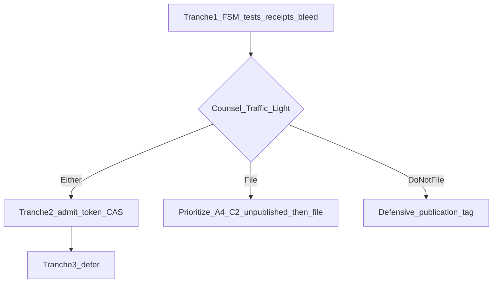

# Patent gaps → dual-use build plan + conversation loose ends

**Purpose:** Inventory every Partial/Missing item from the IP gap audits, pick an engineering tranche that strengthens withOhm **whether counsel says File or Do not file**, and surface unfinished loops from the recent IP / product session.

**Default tranche (chosen):** **Mid-lean** — ship explicit HIT FSM + race tests + receipt admit binding + tree bleed invariants + shared-CAS verification; add digest-bound admit token and ledger event id on receipts. Defer OS socket locks, mid-stream revoke, always-on receipts-as-policy, and full single-blob CAS rewrite until counsel or production need demands them.

---

## 1. Complete gap inventory (from audits)

Legend: **I** = Implemented · **P** = Partial · **M** = Missing

### A — Dual-plane HIT admission FSM

| ID | Gap | Status | Product value if closed (independent of patent) | Patent value |
|----|-----|--------|--------------------------------------------------|--------------|
| A1 | Dual plane + admit-before-serve + deny without body | **I** | — | Baseline |
| A2 | Explicit state machine `LOOKUP → AWAIT_ADMIT → RELEASE \| DENY \| PROXY` (documented + observable) | **P** | Ops clarity, debugging, edge metrics | Strengthens “network/flow control” technical character |
| A3 | OS/socket egress buffer lock | **M** | Low (await-before-build already correct) | Aspirational / rarely worth it |
| A4 | Digest-bound admit token / short-lived lease / fencing | **M** | Prevents stale admit races; cleaner fail modes | Strong intermediate-step story |
| A5 | Race tests (HIT while suspended/capped mid-flight) | **M** (tests) | Correctness under load | Enabling disclosure for A2/A4 |
| A6 | Mid-stream revoke if lease revoked | **M** | Relevant once edge streams cached HITs | Niche until streaming HIT path exists |
| A7 | Gate-down fail-open to full proxy | **I** | — | Document as intentional transition |

### B — Cache tree isolation

| ID | Gap | Status | Product value | Patent value |
|----|-----|--------|---------------|--------------|
| B1 | Namespace key isolation + parent lineage + SHA digests | **I** | — | Baseline |
| B2 | True shared CAS (one blob, many tree refs) | **P** | Redis memory efficiency; cleaner Promote | Memory-management framing |
| B3 | Verify resolve/set paths vs “no duplication” marketing | **P** | Honesty / CARE alignment | Avoid overclaim |
| B4 | Ambient bleed threat model + invariant tests | **P** | Multi-tenant / tip safety | Storage isolation evidence |
| B5 | Novel collision algorithm beyond key+digest | **P**/weak | Low | Do not chase for novelty theater |

### C — Ed25519 receipt handshake

| ID | Gap | Status | Product value | Patent value |
|----|-----|--------|---------------|--------------|
| C1 | Digest ↔ telemetry ↔ tenant fingerprint; pre-release order on edge | **I** | — | Baseline |
| C2 | Ledger / meter **event id** (or hash) bound into receipt | **P** | Audit trail; Stripe/meter reconcile | Crypto bind to admission mutation |
| C3 | Explicit `admit=allow` (and deny path receipts?) + rate-limit epoch | **P** | Clearer third-party verify story | Non-repudiation of admit |
| C4 | Always-on receipts in production | **M** | Trust / enterprise; currently env-gated | Claim “when enabled” is enough legally |
| C5 | Tree id already optional on payload | **I**/partial | Tip audit | Dependent claim material |

### Related engineering honesty gaps (surfaced in earlier IP research, not in § tables)

| ID | Gap | Notes |
|----|-----|--------|
| H1 | Stripe meter `identifier` uses `uuid.uuid4()` when `event_id` empty | Chat / edge-hit do not pass stable `event_id` → retry dedup ≠ request-hash idempotency. SIEGE_DEFENSE can overstate. |
| H2 | `/v1/savings` is `estimate_only` | Do not claim guaranteed savings in patents or marketing SLAs |
| H3 | “1/137 precision” | Not a product claim — keep out of counsel packs and UI |

---

## 2. Dual-use implementation plan (File **or** Do not file)

### Principles

1. Prefer gaps that improve **correctness, auditability, memory, or tip isolation** even if counsel paints Red.
2. Keep **unpublished** designs private until Phase B binary (see `04-DISCLOSURE-INVENTORY.md` freeze rule) — implement behind flags / internal docs first if filing is still open.
3. Do **not** invest in A3 (kernel buffer locks) or B5 (novelty theater).
4. Defer A6 until there is a streaming edge-HIT product need.

### Tranche 1 — Ship soon (high leverage)

| Work | Closes | Outcome |
|------|--------|---------|
| Name and log HIT path states in Rust + Python (`LOOKUP`, `AWAIT_ADMIT`, `RELEASE`, `DENY`, `PROXY`) | A2 | Observable FSM; metrics hooks |
| Integration tests: suspended/capped tenant never receives body on edge HIT; gate-down proxies | A5, A7 | Regression safety |
| Receipt payload: `admit`, optional `rl_epoch`, `meter_event_id` | C2, C3 | Stronger verify + FinOps join |
| Pass stable `event_id` into meter from chat + edge-hit (digest-scoped) | H1, C2 | Real idempotency window for meter sync |
| Tree bleed tests: no ambient cross-tree GET; fork isolation; freeze write deny | B4 | Tip honesty |
| Document shared-CAS reality vs COW parent walk (B3 audit note in CACHE_TREES / honesty) | B3 | Stop overclaim |

### Tranche 2 — Next (still dual-use)

| Work | Closes | Outcome |
|------|--------|---------|
| Short-lived admit token: control plane returns `admit_token` (digest + tenant + exp + sig); edge checks before RELEASE | A4 | Race-hardened release |
| Optional Redis lease key `admit:{tenant}:{digest}` with TTL | A4 | Fence concurrent HIT serves |
| Shared blob key layout investigation → migrate named trees to pointer-to-CAS where safe | B2 | Memory + cleaner Promote |
| Prod receipts: enable seed in staging/prod checklist; feature flag “receipts required” for enterprise | C4 | Trust without mandating in all envs |

### Tranche 3 — Defer (patent-aspirational or low ROI now)

| Work | Why defer |
|------|-----------|
| A3 OS socket buffer locks | No product need; await-before-build suffices |
| A6 Mid-stream HIT revoke | No streaming edge HIT yet |
| B5 Novel fork collision structure | Commodity key layout is enough |
| Broad “always on” receipts with no escape hatch | Breaks local/dev; prefer C4 flag |

### Sequencing diagram

### Effort sketch (engineering, not calendar)

- Tranche 1: concentrated changes in `gateway-rs`, `main.py` edge-hit, `receipts.py`, `metering.py`, pytest + a few Rust parity tests
- Tranche 2: Redis schema + migration care for CAS; admit token crypto aligned with existing Ed25519 machinery
- Tranche 3: skip unless counsel Green depends on it

---

## 3. Conversation loose ends / unfinished loops

Bring forward from the last session (IP assessment → Phase A pack → site UI → Amplify push):

### Still open (action required)

| # | Loop | Status | Next action |
|---|------|--------|-------------|
| 1 | **Phase B — attorney Traffic Light** | Pack ready (`docs/ip/BRIEF.md`); emails **not** sent by agent | You send `05-EMAIL-TEMPLATE.md` + `BRIEF.md` to Kilburn & Strode, Elkington and Fife, Venner Shipley (£1.5–2.5k + VAT cap) |
| 2 | **Phase C-1 / C-2** | Blocked on #1 | File narrow claims **or** defensive-publication git tag + PDF snapshot |
| 3 | **Disclosure freeze** | In force until #1 returns | No public RFCs on admit-token / CAS redesign |
| 4 | **Defensive publication snapshot** | Explicitly “Not done in Phase A” | Do after Do-not-file **or** after filing priority date |
| 5 | **Meter `event_id` / SIEGE overstatement** | Identified in research; **not fixed in code** | Tranche 1 (H1) |
| 6 | **Shared-CAS verification (B3)** | Called out; not audited in code this session | Tranche 1 doc + code check |
| 7 | **Amplify deploy confirmation** | Pushed `e7f0e5b` to `master`; deploy success **not verified** here | Check Amplify console / www.withohm.dev for enablement grid + rail shape |
| 8 | **Git workspace state** | Cloud agent now on `HEAD (no branch)` in `/workspace` | Confirm local vs cloud sync; avoid divergent edits |

### Closed or parked

| Item | Notes |
|------|--------|
| Exact+semantic framing corrected | Locked to exact-only |
| Aerotel → Emotional Perception [2026] UKSC 3 | Pack updated |
| Single-file BRIEF | Done |
| Enablement UI + payload/rail polish | Committed and pushed |
| Contacting attorneys on your behalf | Out of scope unless you ask |

### Soft risks to remember

- Public repo + site already **defensive prior art** (and novelty clock against yourselves).
- Marketing “zero double charge” ≠ meter idempotency until H1 lands.
- Plan-mode IP assessment lived in `.cursor/plans/`; durable artifacts are under `docs/ip/`.

---

## 4. Recommended immediate order

1. **You:** send BRIEF to the three firms (Phase B).  
2. **Eng (parallel, dual-use):** start **Tranche 1** — does not wait on counsel; improves product either way.  
3. **You:** confirm Amplify/`www` shows enablement grid + new rails.  
4. After Traffic Lights: either file (protect unpublished Tranche 2 pieces first) or tag defensive publication and continue Tranche 2 in the open.
