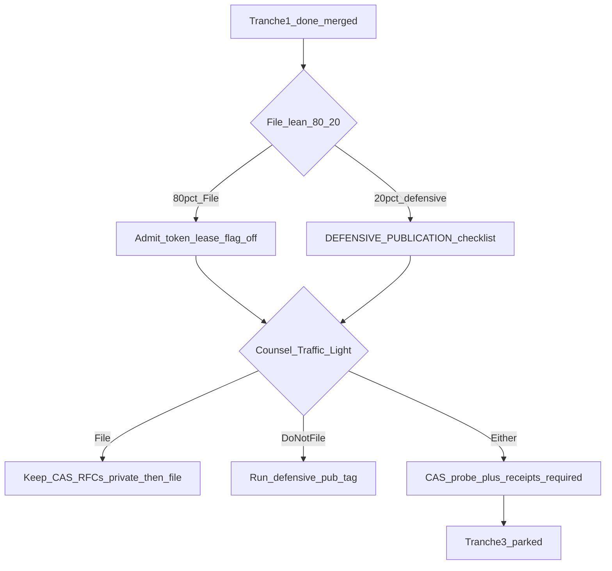

# Patent gaps → dual-use build plan + conversation loose ends

**Purpose:** Inventory every Partial/Missing item from the IP gap audits, pick an engineering tranche that strengthens withOhm **whether counsel says File or Do not file**, and surface unfinished loops from the recent IP / product session.

**Default tranche (chosen):** **Mid-lean** — ship explicit HIT FSM + race tests + receipt admit binding + tree bleed invariants + shared-CAS verification; add digest-bound admit token and ledger event id on receipts. Defer OS socket locks, mid-stream revoke, always-on receipts-as-policy, and full single-blob CAS rewrite until counsel or production need demands them.

---

## 1. Complete gap inventory (from audits)

Legend: **I** = Implemented · **P** = Partial · **M** = Missing

### A — Dual-plane HIT admission FSM

| ID | Gap | Status | Product value if closed (independent of patent) | Patent value |
|----|-----|--------|--------------------------------------------------|--------------|
| A1 | Dual plane + admit-before-serve + deny without body | **I** | — | Baseline |
| A2 | Explicit state machine `LOOKUP → AWAIT_ADMIT → RELEASE \| DENY \| PROXY` (documented + observable) | **P** | Ops clarity, debugging, edge metrics | Strengthens “network/flow control” technical character |
| A3 | OS/socket egress buffer lock | **M** | Low (await-before-build already correct) | Aspirational / rarely worth it |
| A4 | Digest-bound admit token / short-lived lease / fencing | **M** | Prevents stale admit races; cleaner fail modes | Strong intermediate-step story |
| A5 | Race tests (HIT while suspended/capped mid-flight) | **M** (tests) | Correctness under load | Enabling disclosure for A2/A4 |
| A6 | Mid-stream revoke if lease revoked | **M** | Relevant once edge streams cached HITs | Niche until streaming HIT path exists |
| A7 | Gate-down fail-open to full proxy | **I** | — | Document as intentional transition |

### B — Cache tree isolation

| ID | Gap | Status | Product value | Patent value |
|----|-----|--------|---------------|--------------|
| B1 | Namespace key isolation + parent lineage + SHA digests | **I** | — | Baseline |
| B2 | True shared CAS (one blob, many tree refs) | **P** | Redis memory efficiency; cleaner Promote | Memory-management framing |
| B3 | Verify resolve/set paths vs “no duplication” marketing | **P** | Honesty / CARE alignment | Avoid overclaim |
| B4 | Ambient bleed threat model + invariant tests | **P** | Multi-tenant / tip safety | Storage isolation evidence |
| B5 | Novel collision algorithm beyond key+digest | **P**/weak | Low | Do not chase for novelty theater |

### C — Ed25519 receipt handshake

| ID | Gap | Status | Product value | Patent value |
|----|-----|--------|---------------|--------------|
| C1 | Digest ↔ telemetry ↔ tenant fingerprint; pre-release order on edge | **I** | — | Baseline |
| C2 | Ledger / meter **event id** (or hash) bound into receipt | **P** | Audit trail; Stripe/meter reconcile | Crypto bind to admission mutation |
| C3 | Explicit `admit=allow` (and deny path receipts?) + rate-limit epoch | **P** | Clearer third-party verify story | Non-repudiation of admit |
| C4 | Always-on receipts in production | **M** | Trust / enterprise; currently env-gated | Claim “when enabled” is enough legally |
| C5 | Tree id already optional on payload | **I**/partial | Tip audit | Dependent claim material |

### Related engineering honesty gaps (surfaced in earlier IP research, not in § tables)

| ID | Gap | Notes |
|----|-----|--------|
| H1 | Stripe meter `identifier` uses `uuid.uuid4()` when `event_id` empty | Chat / edge-hit do not pass stable `event_id` → retry dedup ≠ request-hash idempotency. SIEGE_DEFENSE can overstate. |
| H2 | `/v1/savings` is `estimate_only` | Do not claim guaranteed savings in patents or marketing SLAs |
| H3 | “1/137 precision” | Not a product claim — keep out of counsel packs and UI |

---

## 2. Dual-use implementation plan (File **or** Do not file)

### Principles

1. Prefer gaps that improve **correctness, auditability, memory, or tip isolation** even if counsel paints Red.
2. Keep **unpublished** designs private until Phase B binary (see `04-DISCLOSURE-INVENTORY.md` freeze rule) — implement behind flags / internal docs first if filing is still open.
3. Do **not** invest in A3 (kernel buffer locks) or B5 (novelty theater).
4. Defer A6 until there is a streaming edge-HIT product need.

### Tranche 1 — Ship soon (high leverage)

| Work | Closes | Outcome |
|------|--------|---------|
| Name and log HIT path states in Rust + Python (`LOOKUP`, `AWAIT_ADMIT`, `RELEASE`, `DENY`, `PROXY`) | A2 | Observable FSM; metrics hooks |
| Integration tests: suspended/capped tenant never receives body on edge HIT; gate-down proxies | A5, A7 | Regression safety |
| Receipt payload: `admit`, optional `rl_epoch`, `meter_event_id` | C2, C3 | Stronger verify + FinOps join |
| Pass stable `event_id` into meter from chat + edge-hit (digest-scoped) | H1, C2 | Real idempotency window for meter sync |
| Tree bleed tests: no ambient cross-tree GET; fork isolation; freeze write deny | B4 | Tip honesty |
| Document shared-CAS reality vs COW parent walk (B3 audit note in CACHE_TREES / honesty) | B3 | Stop overclaim |

### Tranche 2 — File-lean bifurcation (80% File / 20% defensive)

**Allocation:** ~80% engineering toward **File** (A4 admit fencing, flag-off);
~20% keep a ready **Do-not-file** path ([DEFENSIVE-PUBLICATION.md](DEFENSIVE-PUBLICATION.md)).

| Work | Closes | Outcome |
|------|--------|---------|
| Short-lived admit token: control plane returns `admit_token` (digest + tenant + exp + HMAC); edge checks before RELEASE when `AT_RS_ADMIT_REQUIRE` | A4 | Race-hardened release |
| Redis/Memory lease key `admit:{tenant}:{digest}` for in-flight gate (released in `finally`) | A4 | Fence concurrent HIT admits |
| Pre-filing note [PREFILE-ADMIT-FENCING.md](PREFILE-ADMIT-FENCING.md) | A4 counsel | Claim-oriented summary without Show HN RFC |
| Defensive publication checklist (tag + PDF) — **not executed** while File-lean | Do-not-file prep | 20% track |
| Shared blob key layout investigation → migrate named trees to pointer-to-CAS where safe | B2 | Next after A4 green |
| Prod receipts: enable seed in staging/prod checklist; feature flag “receipts required” for enterprise | C4 | Trust without mandating in all envs |

### Tranche 3 — Explicitly deferred (do not build unless counsel Green *depends* on it)

| Work | Why deferred | Revisit trigger |
|------|--------------|-----------------|
| **A3** OS / socket egress buffer locks | Await-before-build + admit token already prevent body release without admit; kernel buffer tricks are low ROI and weak product value | Concrete residual race that survives A4 in production traces |
| **A6** Mid-stream HIT revoke | No streaming edge-HIT product path yet; revoke needs a live stream handle | Edge serves cached SSE/chunked HIT and product needs cancel-on-suspend |
| **B5** Novel fork / collision structures beyond key+digest | Commodity namespacing is enough; novelty theater burns counsel time | Never for patent theatre; only if a real tip-isolation bug needs a new structure |
| Broad “always-on receipts, no escape hatch” | Breaks local/dev and smoke; prefer C4 enterprise flag | Enterprise contract that forbids HIT without JWS |

Tranche 3 is **not** “nice to have later” backlog — it is **parked with kill criteria**. Default action: do nothing.

### Sequencing diagram

### Effort sketch (engineering, not calendar)

- Tranche 1: done (`#42`)
- Tranche 2 File-lean: `admit_fencing.py`, edge-hit lease, Rust `AT_RS_ADMIT_REQUIRE`, pytest; neon rail widen (product)
- Tranche 2 rest: Redis schema care for CAS; receipts-required flag
- Tranche 3: skip unless Green depends on A3/A6

---

## 3. Conversation loose ends / unfinished loops

Bring forward from the last session (IP assessment → Phase A pack → site UI → Amplify push):

### Still open (action required)

| # | Loop | Status | Next action |
|---|------|--------|-------------|
| 1 | **Phase B — attorney Traffic Light** | Briefs **sent**; awaiting Red/Amber/Green per A/B/C | After opinions → File vs Do-not-file binary |
| 2 | **Phase C-1 / C-2** | Blocked on #1 | File narrow claims **or** run [DEFENSIVE-PUBLICATION.md](DEFENSIVE-PUBLICATION.md) |
| 3 | **Disclosure freeze on unpublished CAS RFCs** | Softened for flag-off A4 code + PREFILE note | Still no blog RFC on shared-CAS redesign until binary |
| 4 | **Defensive publication snapshot** | Checklist ready; **not tagged** (File-lean) | Execute only on Do-not-file / post-priority |
| 5 | **Amplify deploy confirmation** | Pushed enablement + Tranche 1; verify www | Check rails width after this neon widen lands |

### Closed or parked

| Item | Notes |
|------|--------|
| Exact+semantic framing corrected | Locked to exact-only |
| Aerotel → Emotional Perception [2026] UKSC 3 | Pack updated |
| Single-file BRIEF | Done |
| Enablement UI + payload/rail polish | Committed and pushed |
| Tranche 1 dual-use eng | Merged `#42` |
| Meter `event_id` / SIEGE overstatement | Fixed |
| Shared-CAS honesty (B3) + bleed tests (B4) | Done |
| Tranche 3 A3/A6/B5/always-on | **Parked** — see table above |

### Soft risks to remember

- Public repo + site already **defensive prior art** (and novelty clock against yourselves).
- Digest-scoped meter ids make **retry sync** idempotent per plane — not “never bill two distinct HIT crossings.”
- Merging flag-off A4 code is enablement disclosure — counsel should treat PREFILE note as part of the File pack.

---

## 4. Recommended immediate order

1. **Counsel:** return Traffic Lights (Phase B in flight).  
2. **Eng:** File-lean Tranche 2a (admit fencing flag-off) + wider neon rails — this branch.  
3. **You:** confirm Amplify/`www` after merge.  
4. After Traffic Lights: **File** (protect remaining CAS unpublished pieces) or run defensive-pub checklist; Tranche 3 stays parked.
